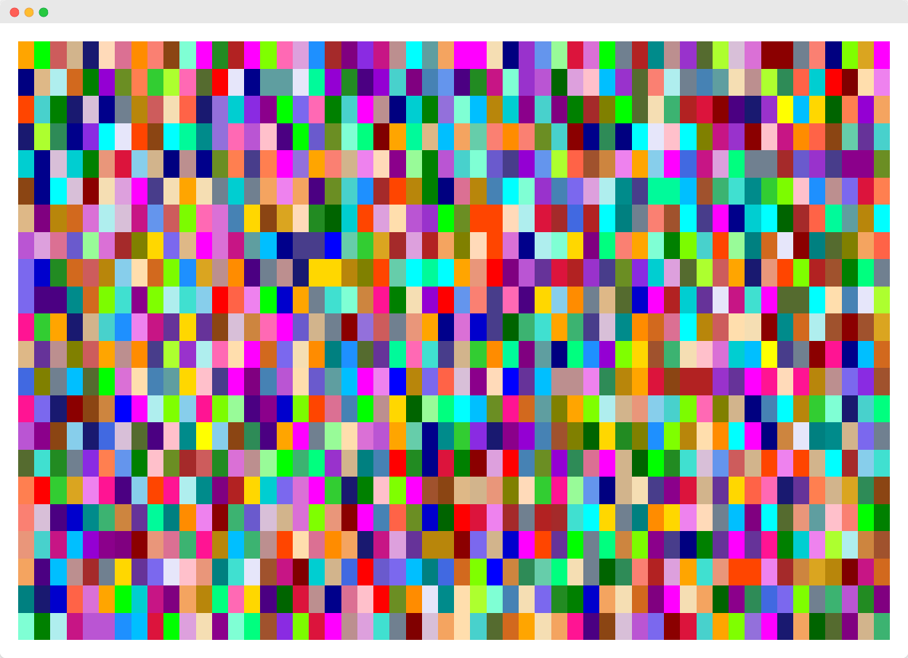
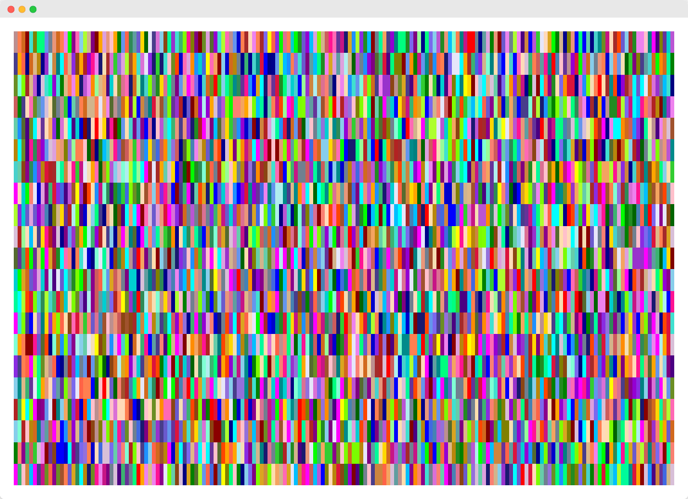
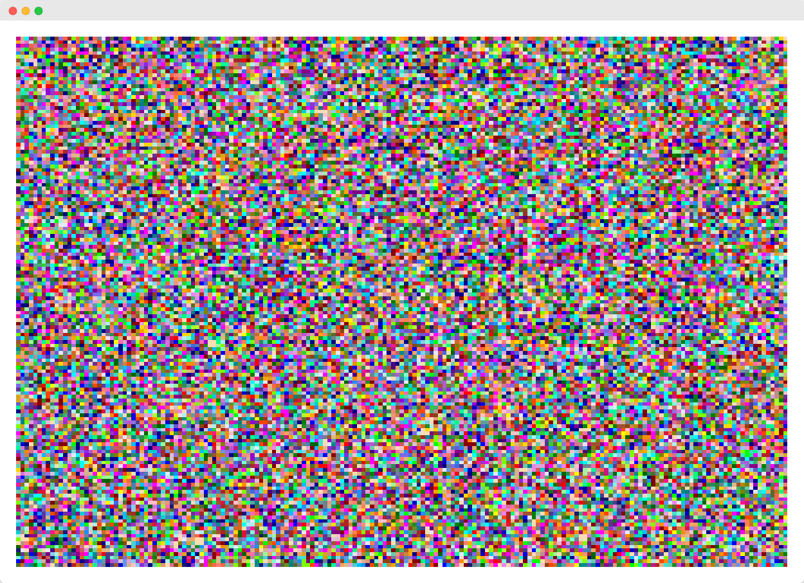
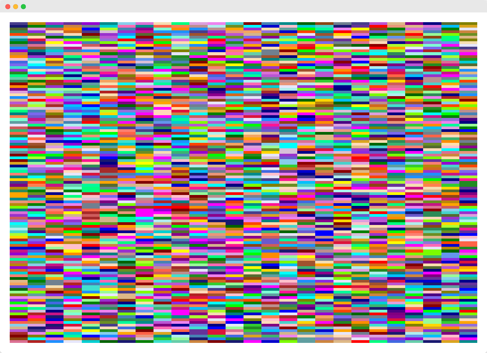

### 🎨 NOTHING LASTS FOREVER 👀

Onload the page randomly generates a piece of art consisting of random sized squares/rectangles and random colour fills.

The white border acts a frame for the artwork.

Each one is almost certainly unique.

Enjoy the joy of the ephemeral.

### 📚 What I learnt
- How to use `<template>` elements along with `.cloneNode(true)`
- The importance of using asyncronous methods when dealing with dynamically generated elements

### 🦺 Testing
- Works on latest version of Firefox, Chrome and Edge

### ⏳ Future improvements
- [ ] Save artworks to computer
- [ ] Number and print option so each one is unique

### 👀 Screenshots

